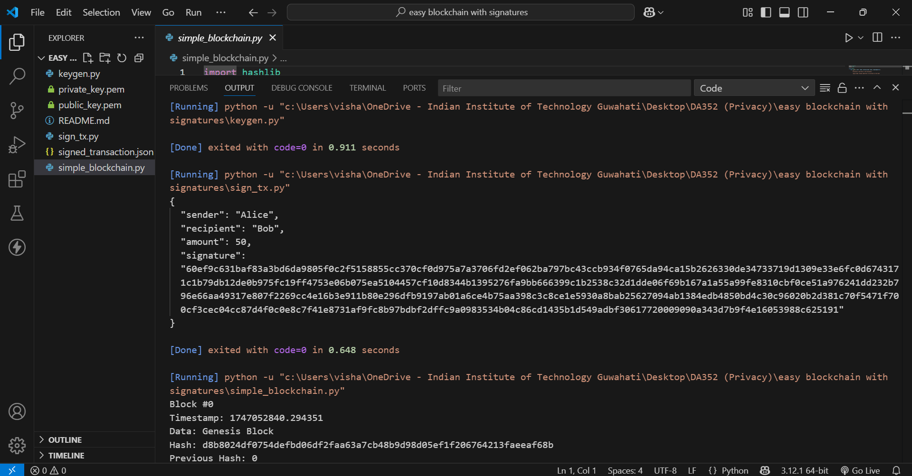

# 🧾 Easy Blockchain with Digital Signatures

This is a simple Python project that demonstrates how **blockchains** can be combined with **digital signatures** to ensure secure, tamper-proof transactions.

---

## 🎯 Objective

To build a simple blockchain and show how digital signatures protect transaction authenticity and detect any tampering.

---

## 📂 Project Structure

easy-blockchain-with-digital-signatures/
│
├── keygen.py # Generates RSA key pair (private/public)
├── sign_tx.py # Signs a transaction using private key
├── simple_blockchain.py # Implements and verifies a simple blockchain
├── signed_transaction.json # Stores the signed transaction
├── private_key.pem # Generated private RSA key
├── public_key.pem # Generated public RSA key
└── README.md # Project documentation

---

## ⚙️ How It Works

### 1. Key Generation
Run `keygen.py` to generate a **2048-bit RSA** public-private key pair:

```bash
python keygen.py
```
This creates:

- private_key.pem: For signing transactions

- public_key.pem: For verifying signatures

### 2. Signing a Transaction
Run `sign_tx.py` to create and sign a transaction:

```bash
python sign_tx.py
```
This produces a signed_transaction.json that looks like this:
```bash
{
  "sender": "Alice",
  "recipient": "Bob",
  "amount": 50,
  "signature": "..."
}
```

### 3. Blockchain Validation
Run `simple_blockchain.py` to:
- Create a blockchain
- Validate its integrity
- Simulate tampering and show how it's detected

```bash
python simple_blockchain.py
```

Example output:
```bash
Is blockchain valid? True
Block 1 has an invalid hash
Is blockchain valid after tampering? False

```

---

## 📌 Key Concepts
- Blockchain: A chain of blocks, each containing transaction data and a hash that links to the previous block.

- Digital Signature: Ensures that a transaction has not been altered and was created by a verified sender.

- Tampering Detection: Any change in a signed block or hash breaks the chain's validity.

---

## ✅ Requirements
- Python 3.6+

- cryptography
Install dependencies:
```bash
pip install cryptography
```

---

## 🔐 Core Concepts

| Concept            | Purpose                                               |
| ------------------ | ----------------------------------------------------- |
| Blockchain         | Chain of blocks that store data with hash pointers    |
| Digital Signatures | Prove sender identity & protect against tampering     |
| SHA256 Hashing     | Used to detect any changes in block data              |
| Public Key Crypto  | Only the holder of the private key can sign a message |

---

## 🎓 Educational Use
This project is perfect for learning about:

- Blockchain fundamentals

- Public-key cryptography

- Data integrity and signature verification

---

## 📸 Sample Output Screenshot:



---

## 👤 Project Members
Goli Poojitha (220150003), Takkellapati Nagendra (220150025), Varakala Rajasree (220150028), Vishal (220150029)
B.Tech in Data Science and Artificial Intelligence
Indian Institute of Technology Guwahati
Course: DA352 - Privacy and Security in Computing

---
